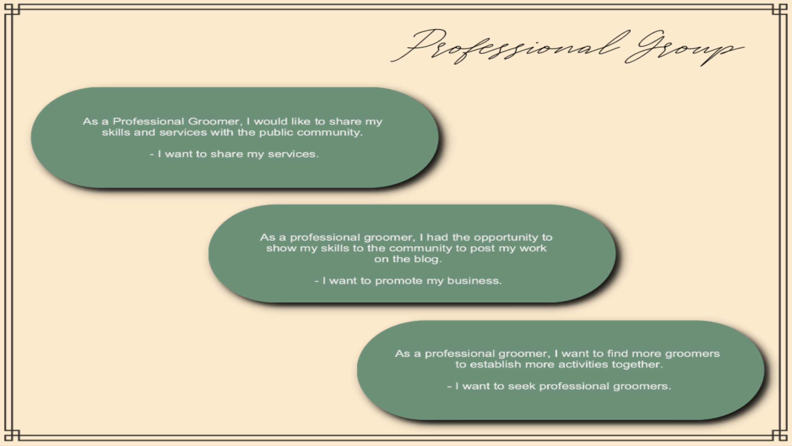

# 💦 🐩 ✨ DIY Grooming Blog – Documentation

**T3A2-A MERN Full-stack App**

Table of Contents:

- [💦 🐩 ✨ DIY Grooming Blog – Documentation](#---diy-grooming-blog--documentation)
  - [Contributors](#contributors)
  - [🗂 Project Documentation](#-project-documentation)
    - [The Problem](#the-problem)
    - [The Blog Purpose](#the-blog-purpose)
    - [Target Audience](#target-audience)
    - [User Personas & User Stories](#user-personas--user-stories)
      - [1️⃣ Dog owners sharing their grooming skills](#1️⃣--dog-owners-sharing-their-grooming-skills)
      - [2️⃣ Dog owners looking for tips/tricks on DIY dog grooming](#2️⃣--dog-owners-looking-for-tipstricks-on-diy-dog-grooming)
      - [3️⃣ Professional dog groomers promoting their services](#3️⃣--professional-dog-groomers-promoting-their-services)
      - [4️⃣ General, dog owners](#4️⃣--general-dog-owners)
    - [Features & Functionalities](#features--functionalities)
      - [Main/Core (MVP) Features](#maincore-mvp-features)
      - [Upcoming Features](#upcoming-features)
    - [Sitemap](#sitemap)
    - [Dataflow Diagram](#dataflow-diagram)
    - [Application Architecture Diagram](#application-architecture-diagram)
      - [Client Side (front-end)](#client-side-front-end)
      - [Server Side (back-end) & Database](#server-side-back-end--database)
    - [Wireframes & UI](#wireframes--ui)
      - [Low Fidelity Wireframes](#low-fidelity-wireframes)
        - [Home (desktop, tablet and mobile)](#home-desktop-tablet-and-mobile)
        - [User Registration (desktop, tablet and mobile)](#user-registration-desktop-tablet-and-mobile)
        - [Individual Post – Read (desktop, tablet and mobile)](#individual-post--read-desktop-tablet-and-mobile)
        - [Write & Edit Post (desktop, tablet and mobile)](#write--edit-post-desktop-tablet-and-mobile)
        - [Profile (desktop, tablet and mobile)](#profile-desktop-tablet-and-mobile)
        - [About (desktop, tablet and mobile)](#about-desktop-tablet-and-mobile)
      - [High Fidelity Wireframes & UI Style Guide](#high-fidelity-wireframes--ui-style-guide)
        - [Home (mobile and desktop)](#home-mobile-and-desktop)
        - [Individual Post (mobile and desktop)](#individual-post-mobile-and-desktop)
        - [Write Post (mobile and desktop)](#write-post-mobile-and-desktop)
    - [Tech Stack](#tech-stack)
    - [Project Management Tools & Utilities](#project-management-tools--utilities)

---

### Contributors

**The { W.A.N.T } Team:**

- Winny Chen
- Angie Hentri
- Natacha Bartu [GitHub](https://github.com/NatachaBartu)
- Thang Za Thang [Github](httpshttps://github.com/thangzathang)

---

## 🗂 Project Documentation

### The Problem

The Notting Hill neighbourhood management approached us to help them create an online blog, dedicated to dog owners in the community.

Ever since the lockdown, many dog owners struggle to keep their beloved pets to stay groomed or in shape, pet groomers are also hard to find in the area and some, unfortunately, have to close their business down.

### The Blog Purpose

The online blog will be used mainly as a platform to share and find step-by-step DIY dog grooming instructions. It can be accessed by the Notting Hill neighbourhood community as well as other people interested in the DIY dog grooming. Anyone including professional groomers can register and share their tips and tricks. Additionally, professional dog groomers can promote their services and possibly be contacted when their service is needed.

### Target Audience

The target audience is divided into four groups:

1. **Dog owners** who <u>want to share</u> their grooming skills

2. **Professional dog groomers** who also <u>want to promote</u> their services and talents
3. **Dog owners** who are interested in DIY dog grooming and <u>looking for tips/tricks</u> and help for their beloved dogs.
4. General and especially **dog lovers**

### User Personas & User Stories

In the initial market research, we selected some of our user personas and their stories to help us understand their needs to determine the blog features and functionalites development. Outlined below, are the revised the user stories based on the feedback received.

<details>
<summary>Please expand to view the initial user stories</summary>
<p><strong>Dog owners sharing their grooming skills</strong></p>

<hr/>
<p><strong>Dog owners looking for tips/tricks on DIY dog grooming</strong></p>

<hr/>
<p><strong>Professional dog groomers promoting their services</strong></p>

<hr/>
<p><strong>General and dog lovers</strong></p>

</details>

---

↓ **_User personas with the revised user stories_**

#### 1️⃣ Dog owners sharing their grooming skills


**As a dog owner,**

- I want to share how I normally groom my pet to my friends.

- I enjoy grooming my dog at home and I want to share how to do it step by step so my friends and other people can do their own DIY grooming for their beloved pets.

- I want to be log in and log out, and able to access my account and see the posts I made

- I want to know other people who have the same dog breed as I am


**As a dog owner and pet grooming teacher,**

- I want to showcase my grooming skills to others.
- I want to share the best methods to groom pets, especially since I have experience handling various pets according to their breed and size, so that when people do their DIY grooming, it will not hurt their back, wrists and help calm their pets during grooming.


**As a dog owner and influencer on Youtube and Instagram,**

- I want to share videos of how me and my family groom our dogs.
- I want to show the before and after photos of how I groom my family’s dog
- I want to gain exposure and more followers by sharing my DIY skills and talent

#### 2️⃣ Dog owners looking for tips/tricks on DIY dog grooming


**As a dog owner in the Notting Hill community,**

- I want to be part of the community by being involved in the community programs
- I want to find ways to help me look after my chihuahua
- I want to know how I can trim her nails without being bitten
- I want to watch good step by step videos about how to trim chihuahua’s nails
- I want to motivate other dog owners to do have some fun with our beloved dogs
- I want to let people know how I appreciate their sharing


**As a (Golden Retriever) dog owner,**

- I want to search the best way to look after my silly Golden Retriever
- I want to watch videos on tricks for bathing my Golden Retriever who hates taking a bath safely
- I want to learn the skills to specifically groom and look after my Golden Retriever
- I want to get to know fellow dog owners in the area and make new friends to play with our dogs


**As a busy (Poodle) dog owner,**

- I want to learn how to groom my Poodle step by step
- I want to learn step by step how to comb and treat my Poodle’s knots
- I want to know how to keep my dog healthy and happy
- I want to read tips and tricks to be more confident in looking after my dog and keep her clean
- I want to see photos of how people groom their Poodles and other dogs
- I want to be able to save a post to read later

#### 3️⃣ Professional dog groomers promoting their services


**As a professional groomer in Notting Hill,**

- I want to share my skills to the community
- I want to write tips and tricks about how to look after dogs
- I want to be able to manage my posts so I know what new posts I can write next
- I want to showcase my skills and demonstrate how I look after my clients’ pets
- I want my posts readers to know that I am a professional groomer
- I want to promote and offer mobile grooming services
- I want to gain exposure and improve my service reputation in Notting Hill and the surrounding areas


**As a professional groomer,**

- I want people to trust me as I am a professional groomer with proven expereince
- I want to teach the best way to look after dogs based on their size step by step through videos and photos
- I want to teach how to keep pets clean at home and keep them happy
- I want to show tips and tricks and the best tools to groom dogs based on their size
- I want my posts readers to be able to contact me and comment on my posts

#### 4️⃣ General, dog owners

**As a dog lover in Notting Hill,**

- I want to see cute photos of dogs in the community

- I want to see the the before and after grooming photos

- I want to read people’s experience with their dogs as I always wanted a dog

- I want to comment on people’s posts and contact them to ask questions

**As a dog lover and a potential pet owner,**

- I want to see photos and videos of dog grooming
- I want to compliment and appreciate people’s skills in grooming their dogs
- I want to see different dogs breeds and sizes
- I want to see how hard it is to groom and look after dogs

### Features & Functionalities

The blog is accessible publicly by anyone not restricted to the Notting Hill community only. The posts and the individual posts are viewable to all type of users.

In general, the basic features and functionalities are:

- Navigation on every page for easy access to different pages of the blog
- Search function –– for searching posts
- Posts filtering or sorting function –– filter by popularity (most likes), recent, and dog breed or size
- User interface for better readibility of the step by step grooming through the choose of calming colours and appropriate fonts

Based on the user experience research, we have determined the following main and core features and functionalites for the online blog:

#### Main/Core (MVP) Features

There are two main user groups, registered users and general (non-registered) users.

<u>**General (non-registered users)**</u>

- Can only view the homepage, about/info page, and individual blog posts

- Can register or sign-up for an account

**<u>Registered users</u>**

- Can login, logout
- Own posts:
  - Create, Read, Update, Delete their own posts
    - Can only include a link of video to be embedded in the post
    - Can only upload 1 before photo and 1 after photo
    - Can write many instruction steps, but will hint/advise user to write up to 7 steps maximum to prevent long posts
- Other people's posts:
  - Can comment
  - Can like or unlike
  - Can save or bookmark
- Profile page:
  - Can manage their posts
  - Can upload a profile photo and change / delete it
  - Can include their location
  - Can include their website or social media link
  - Can write a brief description or bio (for other users to read and contact for connection)
  - Can see and access saved or bookmark posts
- Can view other user profile page _(accessible through clicking a user's name through posts and comments)_:
  - See the user's location
  - See the user's posts list
  - Contact the user through the contact form
- **Professional Groomers:**
  - Can obtain 'professional badge' beside their name which is visible to everyone

#### Upcoming Features

**<u>Registered users</u>**

- Google map geo-location feature
- Follow or Add friends features between registered users

<u>**Admin features**</u>

- Access for authorised users to help moderate the online blog
- Ways to verify and authenticate professional groomers

**<u>Others</u>**

- Professional Groomers service listing
- Ways to customise the site color themes (e.g., dark mode)

### Sitemap


### Dataflow Diagram


The flow of data starts at **Guest** and ends with **Liking the Post**.

The diagram is labeled with numbers so that it is easier to follow:

- Guest will either create an account (1) or login (1.5).
- Everyone can view posts made by registered users (2).
- Guest must sign up (1) for more features.
- Users have access to more features:
  - They can create their own posts (4),
    - They can edit their own posts (4.4)
    - and delete them later (4.2).
  - Users can also comment (6) and like (6.5) on their own posts and other's posts.
- `State` is the local redux state that will communicate with the external API which are the Mongo `Users` and Mongo `Posts`.

<small>References: [External reference 1](https://www.youtube.com/watch?v=ztZsEI6C-mI&t=87s) –– [External reference 2](https://www.youtube.com/watch?v=WzcKgo7BQC0&t=566s)</small>

### Application Architecture Diagram


There are three entities: the client side (front-end), server side (back-end) and the database.

#### Client Side (front-end)


- The front end is in React JS with Material UI library.

- We will deploy on Netlify.

- State management will be handled by React Redux

- Axios will be used to communicate to the backend.

#### Server Side (back-end) & Database


- The backend is in Node JS, to be deployed on Heroku.
- We will use Express.js and it's router to receive and send back response to communicate with the backend.
- For our security, we are leaning towards JSON web tokens and Bcrypt.
- Mongoose will be used to manipulate the collections in the actual MongoDB.

### Wireframes & UI

#### Low Fidelity Wireframes

##### Home (desktop, tablet and mobile)


##### User Registration (desktop, tablet and mobile)


##### Individual Post – Read (desktop, tablet and mobile)


##### Write & Edit Post (desktop, tablet and mobile)


##### Profile (desktop, tablet and mobile)


##### About (desktop, tablet and mobile)


#### High Fidelity Wireframes & UI Style Guide

For teamwork's clarity we think that some high-fidelity wireframes are necessary to help everyone to be on the same page with regards to styling and provide clear blueprint.

##### Home (mobile and desktop)


##### Individual Post (mobile and desktop)


##### Write Post (mobile and desktop)


We also created a basic style guide to help maintain design consistency on the overal user interface.


### Tech Stack

- MERN Stack
- Server side (back-end)
  - Node.js
  - Express.js
  - Mongoose
  - MongoDB Database
- Client side (front-end)
  - React.js
  - Material UI library
  - Moments
  - Axios
  - React Redux
- Testing
  - Jest
  - React-Jest
  - Cypress
- External
  - Authorisation – Firebase auth
  - Storage – AWS3 Bucket for user image uploads or Firebase Storage
- Deployment & Hosting
  - Netlify for front-end
  - Heroku for back-end

### Project Management Tools & Utilities

- For communication, we use **_Discord_** private channel and utilised the voice meeting and screen sharing features for remote working.
- For file management and sharing, we use **_Google Drive_** cloud service and **_GitHub_**.
- Utilised **_Trello_** board for Kanban workflow agile management system, such as:
  - Help manage workloads, e.g., assign team members for tasks and sub-tasks
  - Oversee the project timeline and use deadline on cards to ensure tasks are completed as planned
  - (Will be utilised more in Part B) Organise the project's structure, components, elements, such as MVP features and possible upcoming features


Trello board link:

```
https://trello.com/b/lODYCsYA
```

---

<small>© 2021-2022 –– by the {  W .  A ☁️  N 🐶  T 🐸 } team </small>
